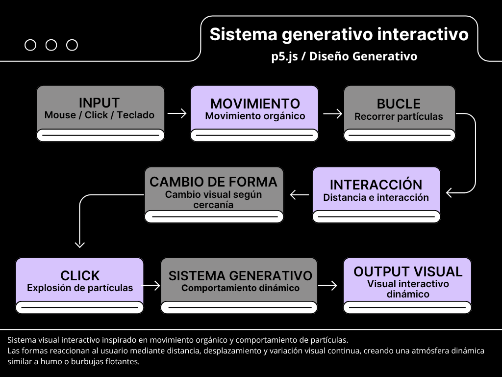

# Solemne-2-Pensamiento-Computacional
Sistema generativo interactivo inspirado en burbujas translúcidas. Las partículas reaccionan al movimiento del mouse y cambian de forma mediante variación aleatoria, condicionales e interacción en tiempo real usando p5.js.
# README — Solemne II  
## Burbujas Generativas Interactivas

Sistema visual interactivo desarrollado en p5.js inspirado en humo, burbujas translúcidas y comportamiento orgánico.

Las partículas reaccionan al movimiento del mouse, cambian de forma según cercanía y generan distintas visualidades mediante variación aleatoria, interacción en tiempo real y condicionales.

---

# Vista previa

[Ver video del proyecto](    

https://github.com/user-attachments/assets/e092cc5b-f844-403e-8d52-f16eadb9d89c

)

---

# Concepto

El proyecto explora el diseño generativo mediante un sistema de partículas autónomas que responden al usuario.

La intención visual fue crear una atmósfera suave y orgánica inspirada en humo, fluidos y burbujas translúcidas.

Las partículas funcionan como unidades independientes del sistema:

- se desplazan
- reaccionan
- cambian de forma
- modifican su comportamiento según inputs externos

---

# Corriente de diseño

Este proyecto se relaciona principalmente con:

## Diseño generativo

Debido al uso de:

- sistemas autónomos
- repetición
- variación aleatoria
- reglas programadas
- comportamiento emergente

## Arte cinético

Por el movimiento constante y la interacción visual en tiempo real.

---

# Input

El sistema utiliza distintos tipos de input:

| Input | Función |
|---|---|
| Mouse | Repele partículas |
| Click | Activa caritas y explosión |
| Flechas teclado | Desplazan sistema |

---

# Proceso

El sistema funciona mediante:

- arrays
- loops
- condicionales
- random()
- dist()
- interacción en tiempo real

Cada partícula:

1. posee posición y tamaño propio
2. se mueve aleatoriamente
3. detecta cercanía del mouse
4. cambia de comportamiento según distancia
5. modifica su visualidad dinámicamente

---

# Sistema visual

## Lejos del mouse

Las partículas aparecen como burbujas translúcidas.

## Cerca del mouse

Las partículas reaccionan y modifican forma.

## Click

Las partículas cercanas muestran caritas y generan explosión visual.

---

## Diagrama de flujo del sistema

El siguiente diagrama representa el funcionamiento lógico del sistema generativo interactivo desarrollado en p5.js.

    


# Código relevante

```javascript
let distancia = dist(
  x[i],
  y[i],
  mouseX,
  mouseY
);
```

La función `dist()` permite calcular cercanía entre partículas y mouse para modificar comportamiento visual.

---

```javascript
x[i] = x[i] + random(-1, 1);
```

La función `random()` genera pequeñas variaciones que producen movimiento orgánico tipo humo.

---

# Herramientas utilizadas

- p5.js
- JavaScript
- GitHub

---

# Autor/a

Javiera Ortega  
Solemne II — Pensamiento Computacional  
23/05/2026
